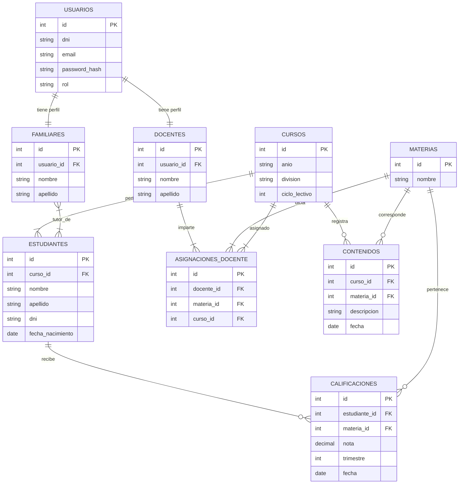

```mermaid
erDiagram
    USUARIOS ||--|| DOCENTES : "tiene perfil"
    USUARIOS ||--|| FAMILIARES : "tiene perfil"
    CURSOS ||--|{ ESTUDIANTES : "pertenece"
    FAMILIARES }|--|{ ESTUDIANTES : "tutor_de"
    DOCENTES ||--|{ ASIGNACIONES_DOCENTE : "imparte"
    MATERIAS ||--|{ ASIGNACIONES_DOCENTE : "dicta"
    CURSOS ||--|{ ASIGNACIONES_DOCENTE : "asignado"
    ESTUDIANTES ||--o{ CALIFICACIONES : "recibe"
    MATERIAS ||--o{ CALIFICACIONES : "pertenece"
    CURSOS ||--o{ CONTENIDOS : "registra"
    MATERIAS ||--o{ CONTENIDOS : "corresponde"

    USUARIOS {
        int id PK
        string dni
        string email
        string password_hash
        string rol
    }

    ESTUDIANTES {
        int id PK
        int curso_id FK
        string nombre
        string apellido
        string dni
        date fecha_nacimiento
    }

    DOCENTES {
        int id PK
        int usuario_id FK
        string nombre
        string apellido
    }

    FAMILIARES {
        int id PK
        int usuario_id FK
        string nombre
        string apellido
    }

    CURSOS {
        int id PK
        string anio
        string division
        int ciclo_lectivo
    }

    MATERIAS {
        int id PK
        string nombre
    }

    ASIGNACIONES_DOCENTE {
        int id PK
        int docente_id FK
        int materia_id FK
        int curso_id FK
    }

    CALIFICACIONES {
        int id PK
        int estudiante_id FK
        int materia_id FK
        decimal nota
        int trimestre
        date fecha
    }

    CONTENIDOS {
        int id PK
        int curso_id FK
        int materia_id FK
        string descripcion
        date fecha
    }
```
